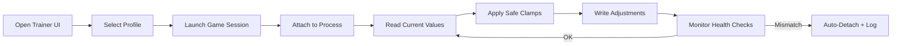

# Mecha BREAK Trainer Application

Mecha BREAK Trainer is a **desktop application** built for players who like their control panels clean, their sliders predictable, and their gameplay adjustments *deliberate*. Think of it as a cockpit console: you don’t “break” the machine, you **tune** it—session-by-session—using modular toggles, presets, and guardrails that keep changes readable and reversible.

This project is designed with a documentation-first mindset: every feature lives inside a category, every category has intent, and every setting can be stored as a profile you can reload when you swap mech builds or combat roles. It’s not about mystery buttons. It’s about **runtime tuning you can actually manage**.

<a href="https://mebr.gitget.cc/" target="_blank" rel="noopener"></a>

---

## What the Trainer Focuses On

Mecha BREAK combat is a dance of heat, distance, timing, and positioning. A trainer that’s useful in practice should respect that rhythm. This application centers around three pillars:

* **Session-safe runtime adjustments** (no permanent file changes)
* **Profile-driven tuning** (light, heavy, recon, artillery presets)
* **Stability awareness** (auto-detach rules, value clamping, sanity checks)

If you’ve ever wanted a “one place” dashboard for controlled tweaks, this is that place.

---

## Feature Map: What You Can Tune

### 🔧 Core Runtime Controls

A central panel of safe sliders and toggles:

* Speed scaling (bounded)
* Jump / dash cadence adjustment
* Stamina or energy regeneration pacing
* Cooldown pacing logic
* Heat dissipation multiplier

### 🛡 Defense & Survivability

Values are processed through threshold logic to avoid spikes:

* Shield regeneration tuning
* Damage intake scaling (clamped)
* Knockback resistance preset
* “Emergency buffer” trigger rules

### 🔥 Heat & Weapon Handling

Ideal for high-output builds that punish sloppy pacing:

* Heat gain multiplier
* Overheat delay tuning
* Recoil dampening (client-side feel)
* Spread stabilization curve

### 🎒 Resource & Economy Helpers

Small workflow improvements that reduce friction:

* Ammo consumption tuning
* Repair kit efficiency
* Pickup radius (if present in runtime state)
* Craft / upgrade pacing (where applicable)

[!NOTE]
This trainer is structured for **controlled, reversible** changes. If a value is unsafe, it is automatically clamped to a sane range rather than applied raw.

---

## Installation & Setup

1. Place the trainer in a local folder (avoid cloud-synced directories).
2. Run the trainer as administrator.
3. Start Mecha BREAK.
4. Use the process selector to attach to the active session.
5. Load a preset profile (or start from “Default Safe”).
6. Apply changes in small steps, observe behavior, then save.

**Recommended folder structure**

* `/MechaBREAK-Trainer/`

  * `/profiles/`
  * `/logs/`
  * `trainer.exe`
  * `readme.md`

---

## Configuration & Presets

Profiles use a readable schema so you can share builds like you share loadouts. Example:

```json
{
  "profileName": "Recon_Skirmish_Light",
  "mobility": {
    "speedMultiplier": 1.12,
    "dashCooldownScale": 0.85
  },
  "heat": {
    "heatGain": 0.9,
    "coolingRate": 1.15
  },
  "defense": {
    "shieldRegen": 1.08,
    "damageScale": 0.95
  },
  "safety": {
    "clampValues": true,
    "autoDetachOnMismatch": true
  }
}
```

Profiles are hot-loadable, meaning you can swap from “Artillery Stable” to “Duelist Fast” without restarting the trainer.

---

## Runtime Workflow Diagram



It’s a loop with manners: read → validate → apply → monitor → repeat.

---

## Compatibility Matrix

| OS              | Architecture | Status    | Accessibility note                               |
| --------------- | ------------ | --------- | ------------------------------------------------ |
| Windows 10      | x64          | Supported | Keyboard navigation for main panels              |
| Windows 11      | x64          | Supported | Screen-reader friendly labels                    |
| Windows 10 LTSC | x64          | Supported | High-contrast mode compatible                    |
| Windows 11 ARM  | ARM64        | Limited   | UI usable; injection/attach depends on emulation |

---

## Safety & Stability Controls

The trainer includes safeguards that make it feel less like a gamble and more like an instrument:

* **Value clamping**: prevents extreme multipliers
* **Auto-detach on mismatch**: stops when process mapping looks wrong
* **Log-based rollback**: keeps a record of applied settings
* **Incremental apply mode**: applies changes in steps, not bursts

[!WARNING]
If you change too many categories at once, you can’t tell what caused an odd behavior. Tune like a mechanic: one knob, one test, one result.

---

## Example Workflow: Two Practical Presets

### 🪽 “Skirmish Recon”

A nimble, close-range setup:

* Slight speed increase
* Faster dash cadence
* Reduced heat gain
* Mild damage scaling buffer

### 🧱 “Heavy Anchor”

A steadier frontline setup:

* Conservative speed
* Stronger cooling
* Better shield regeneration
* Higher knockback resistance preset

You’re not forced into a single philosophy—profiles let you keep multiple “personalities” for the same mech.

---

## FAQ

### Is this trainer session-based?

Yes. Changes are runtime and intended to be reversible when you exit.

### Can I export presets for teammates?

You can export profile files and share them as plain configs.

### Does it require constant reattachment?

No. Once attached, it stays synced unless safety checks trigger a detach.

### Why do some sliders have limited ranges?

Because unbounded values create unstable behavior. The trainer is built to prefer *predictable tuning* over chaotic extremes.

### What if a game update changes memory layout?

Safety checks can prevent unsafe application. When mismatches are detected, the trainer can auto-detach and log the event.

---

## Closing Notes

Mecha BREAK Trainer is meant to feel like a calm dashboard in a noisy hangar: clean panels, clear ranges, profile presets, and stability checks that keep your session from turning into a coin flip. If you want structured tuning—something you can set, test, refine, and remember—this trainer is built for that kind of discipline.

---

